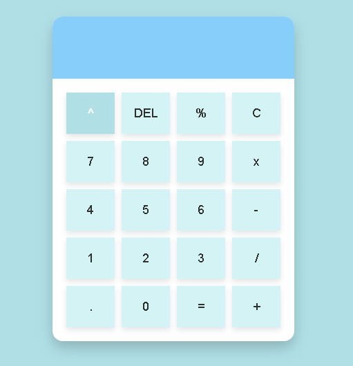

# 💫 Projeto Calculadora Estética

Uma calculadora minimalista e funcional com design clean e moderno, feita com **HTML**, **CSS** e **JavaScript**, destacando-se pelos tons suaves de **Powder Blue**.

---

## ✨ Sobre o Projeto

Este projeto foi desenvolvido para demonstrar como unir funcionalidade e estética em uma aplicação simples. A calculadora suporta operações básicas e avançadas com um layout responsivo, ideal para aprendizado ou uso prático.

---

## 🧩 Recursos

- 🎨 **Interface Aesthetic**: Design minimalista com foco em usabilidade e beleza.  
- 📱 **Responsiva**: Adaptada para diferentes tamanhos de tela, incluindo dispositivos móveis.  
- ✏️ **Funcionalidades completas**: Suporte para adição, subtração, multiplicação, divisão, exponenciação e mais. 

---

## 🛠️ Tecnologias Utilizadas

- **HTML5**: Para estruturar o conteúdo.  
- **CSS3**: Para criar o design e responsividade.  
- **JavaScript**: Para implementar a lógica funcional da calculadora.

---

## 🌈 Paleta de Cores

| Cor            | Hexadecimal |
|-----------------|-------------|
| Powder Blue     | `#b0e0e6`   |
| Branco          | `#ffffff`   |
| Cinza Escuro    | `#2f4f4f`   |

---

## 🤝 Contribuições

Contribuições são sempre bem-vindas! Caso tenha sugestões, ideias ou melhorias, fique à vontade para abrir um **Pull Request** ou relatar um problema.

---

## 📬 Contato

- **Email:* liviaribeirodasilva168@gmail.com
- **GitHub:** [Seu Usuário](https://github.com/WolfstarMoony)

---

🌟 **Obrigado por conferir este projeto! Se gostou, deixe uma ⭐ para apoiar.**
